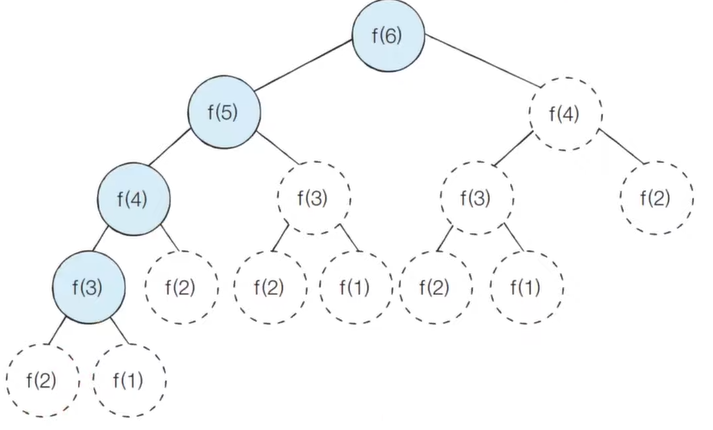

# Dynamic Programming _ 동적 계획법


## 개념

- 메모리를 적절하게 사용하여 수행 시간 효율성을 비약적으로 향상시키는 방법
- 이미 계산된 결과는 별도의 메모리에 저장하여 다시 계산 안하도록
- 일반적으로 구현은 `탑다운` `보텀업` 으로 구성


## 동적(Dynamic) 의미

> DP에서 Dynamic은 별 의미 없이 사용된다...

- 자료구조에서 동적 할당은 **프로그램이 실행되는 도중에 실행에 필요한 메모리를 할당하는 기법**을 의미


## 사용할 수 있는 문제 조건

1. **최적 부분 구조**
   - 큰 문제를 작은 문제로 나눌 수 있고, **<u>작은 문제의 답을 모아서 큰 문제를 해결할 수 있다</u>**
2. **중복되는 부분 문제**
   - 동일한 **<u>작은 문제를 반복</u>**적으로 해결해야 한다

> 대표적인 문제 피보나치 문제


## DP vs 분할 정복

- **공통점** : 최적 부분 구조 ( 큰 문제가 작은 문제로 쪼개지며 작은 답을 모아서 해결 가능)
- **차이점** : DP는 작은 문제가 여러번 중복 호출된다 but 분할 정복은 작은 문제가 **<u>중복 호출 안된다.</u>**


## 메모이제이션 (Memoization)

> 한 번 계산한 결과를 메모리 공간에 메모하는 기법

- 같은 문제를 다시 호출하면 메모했던 결과를 그대로 가져온다
- `캐싱` 이라고도 한다


## 탑다운 vs 보텀업

- `탑다운`방식은 `하향식`이라고도 하며 `보텀업`방식은 `상향식`이라고도 한다
- DP의 전형적인 방식은 `보텀업` 방식이다
  - 결과 저장용 리스트는 `DP테이블` 이라고 부른다


## 예제 코드

### 탑다운

```python
# 한 번 계산된 결과를 메모이제이션 하기 위한 리스트 초기화
d = [0] * 100

# 피보나치 함수를 재귀함수로 구현
def fibo(x):
    # 종료 조건( 1 혹은 2일 때 1을 반환)
    if x == 1 or x == 2:
        return 1
    # 이미 계산한 적 있는 문제라면 그대로 반환
    if d[x] != 0:
        return d[x]
   	# 아직 계산하지 않은 문제라면 점화식에 따라서 피보나치 결과 반환
    d[x] = fibo(x-1) + fibo(x-2)
    return d[x]

print(fibo(99))
```

### 보텀업

```python
# 앞서 계산된 결과를 저장하기 위한 DP 테이블 초기화
d = [0] * 100

# 첫 번째 피보나치 수와 두 번째 피보나치 수는 1
d[1] = 1
d[2] = 1
n = 99

# 피보나치 함수 반복문으로 구현
for i in range(3, n+1):
    d[i] = d[i-1] + d[i-2]
    
print(d[n])
```



## DP문제 접근 방법

- 주어진 문제가 **다이나믹 프로그래밍 유형임을 파악**하는것이 중요
-  `그리디`, `구현`, `완전탐색` 으로 해결할 수 있는지 검토 후 안되면 접근해보기
- 재귀 함수로 비효율적인 완전 탐색 프로그램을 작성한 뒤에 작은 문제에서 구한 답이 큰 문제에서 사용될 수 있으면 코드 개선
- 일반적으로 코딩테스트에서는 **기본 유형을 낸다**. 새로운 유형을 내게되면 점화식 구하는데 시간이 너무 오래 걸리기 때문

> 결론 : **다양하게 많이 풀어보면 대비할 수 있다.**


## LIS 문제

> **Longest Increasing Subsequence 가장 긴 증가하는 수열**

.png)

.png)

.png)

.png)

.png)


