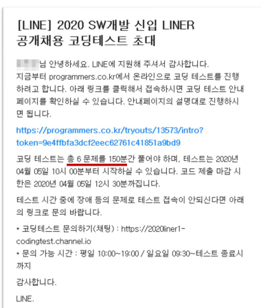
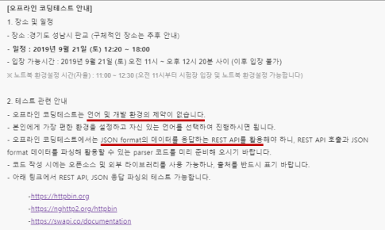
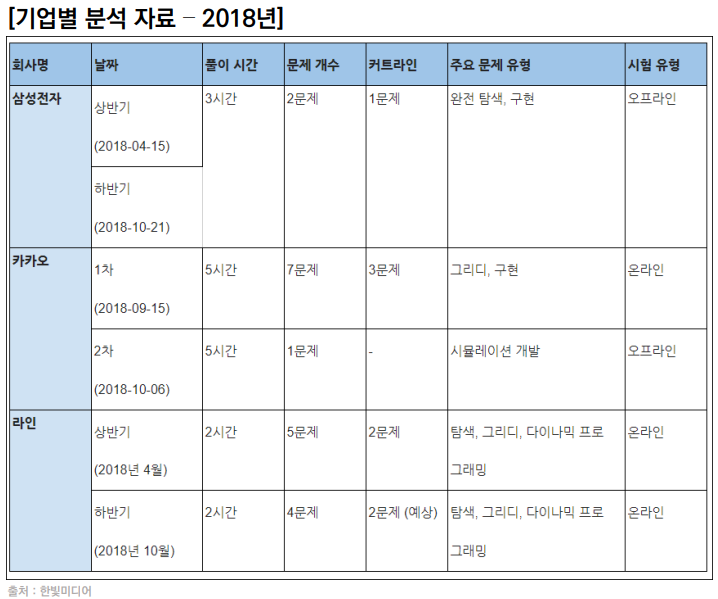
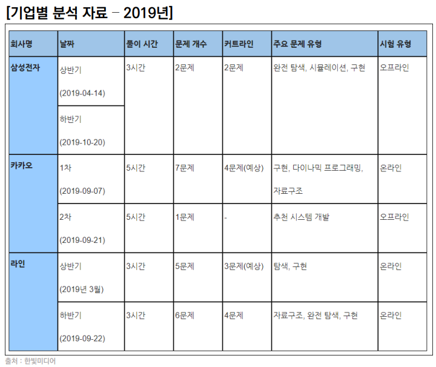

# 알고리즘

#알고리즘 #코딩테스트 #데이터구조


## 알고리즘? 코딩테스트?

### 알고리즘

> 어떤 문제를 해결하기 위해 정해진 일련의 절차나 행동
>
> input을 넣었을때 원하는 output 이 나오도록 하는 것

### 코딩테스트

> 기업에서 지원자를 대상으로 코딩을 통한 `알고리즘 기반` `문제 해결 능력`을 테스트 하는 것

### 코딩테스트 평가사항 두 가지

> 문제 해결력
>
> - 문제 `의도`를 정확히 파악, 적헐한 `해결 방법` 적용 가능?
>
> 구현력
>
> - 해결 방법을 `프로그래밍`을 통해 능숙하게 구현 가능한가?


## 코딩 테스트 종류

### 온라인



> **코딩 테스트 사전 안내 메일**
>
> - 문제풀이 사이트
> - 문제 수
> - 제한 시간
> - 시작 종료 시간

> **꿀팁😎**
>
> - 사전에 연습장, 필기구 준비
>
> - 테스트 케이스 이 외의 엣지 케이스도 확인
>
> - 인터넷, IDE, 알고리즘 노트 적극 활용
>
>   [Python-Competitive-Programming-Team-Notes](https://github.com/ndb796/Python-Competitive-Programming-Team-Notes)

### 오프라인

1. 개발형 코딩테스트(Rest API, JSON)

   

2. 화이트보드 손코딩

   > 지원자가 어떤 방식으로 문제를 해결 하는지 `논리`, `과정`, `커뮤니케이션 스킬`을 평가

### 기업별






## 코딩테스트 준비하기

- # ***많이풀기!***

### 주의할점!

1. 연습 때는 같은 유형의 문제를 단기간에 여러 번 반복하는 것이 좋다.
2. 코딩테스트 직전에는 모의고사처럼 다양한 유형을 시간 제한을 두고 풀어본다.
3. 오랜시간 고민해도 답이 안보이면 답을 보고 이해를 한다. 답을 보고난 후에는 직접 다시 풀어본다.
4. 통상적으로 350개 정도 풀면 무난한 정도로 합격한다.
5. 변수명 대충 짓지 않기
6. 언어가 가지는 내장 함수, 라이브러리를 적극 활용하기
7. 반복되는 코드는 함수화를 통해 가독성 있게 작성
8. 면접을 위해 풀이를 남에게 설명하는 연습 반드시 필요


## 데이터 구조 & 알고리즘

### 왜 데이터 구조가 중요할까?

> 문제 상황에 따라 담기에 더 적합한 통이 있다.
>
> 문제 상황에 따라 더 적합한 도구가 있다.


## 입력 & 출력

### 입력 활용 예시

```python
a, b, c = map(int, input())
>>> 123
print(a + b + c)
>>> ?       

# 6
```

```python
a, b, c = map(int, ???)       # input().split()
>>> 1 2 3
print(a + b + c)
>>> 6
```

### 출력 활용 예시

```python
a, b, c = map(int, input().split())
>>> 1 2 3
print(a, b, c)
>>> ?

# 1 2 3
```

```python
a, b, c = map(int, input().split())
>>> 1 2 3
print(a, b, c, end="&")
>>> ?

# 1 2 3&
```


 
