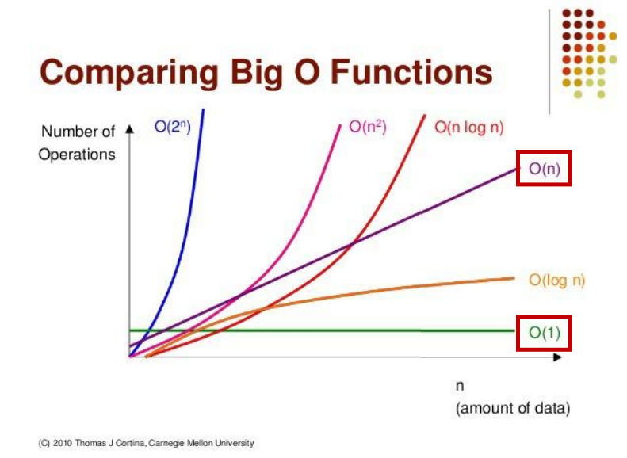
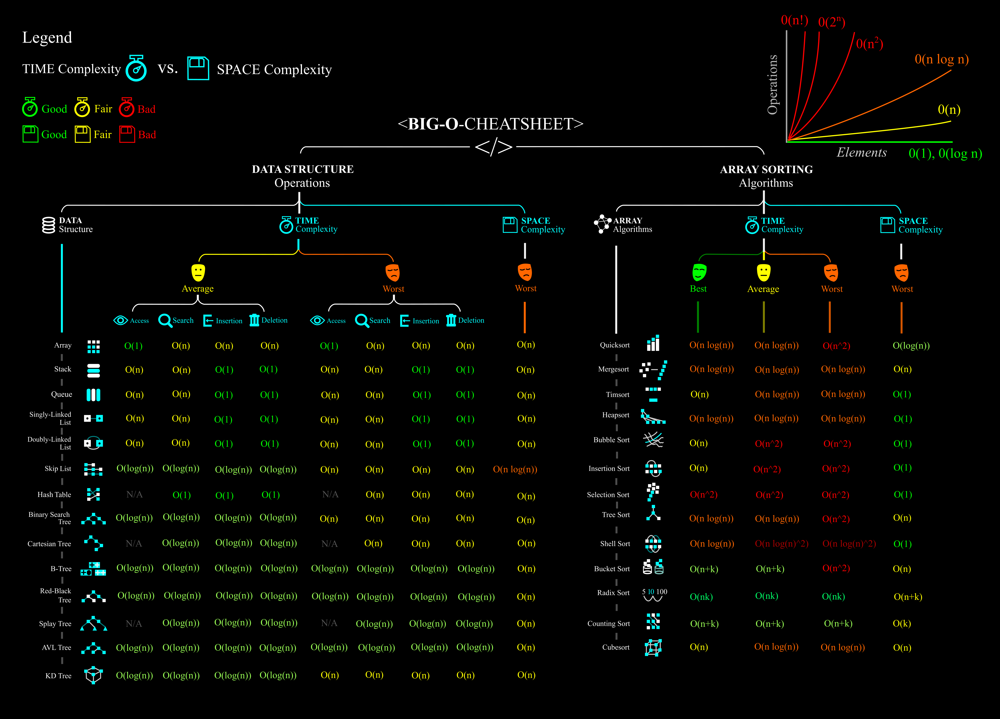

# 시간복잡도&빅오

#시간복잡도 #빅오표기법 #리스트

## 1. 알고리즘 시간 복잡도

1. 좋은 알고리즘이란?

   > input을 넣은 후 output이 나오는 **<u>시간이 짧은</u>** 알고리즘!

2. 알고리즘 소요 시간 측정

   > 개개인의 컴퓨팅 환경에 따라 같은 알고리즘도 측정 시간이 다르다. 기준이 필요!
   >
   > 객관적인 측정을 위해 알고리즘 내부에서 기본 연산이 몇 번 일어나는지 측정

   ```python
   def count(word, char):
   total = 0
   for i in word:
   if i == char:
   total += 1
   return total 
   
   count("apple", "p")    # 문자열 5개 5번
   >>> 2
   
   # "appleapple" 이라면? 10번
   ```

   > 문자열의 개수에 따라 연산 수가 달라진다. 그래서 입력을 통일시켜줘야한다.
   >
   > 최악의 입력n이라고 가정한다. 1억? 정도ㅎㅎ

3. 시간복잡도

   > 요즘 컴퓨터는 성능이 좋아서 메모리를 얼마나 쓰는지 공간복잡도는 크게 신경쓰지 않아도 된다.
   >
   > 시간 복잡도가 더 중요하다.

   시간 복잡도가 높다 => 느린 알고리즘

   시간 복잡도가 낮다 => 빠른 알고리즘

   > 6n+4      3n+2    3n^2+6n+1
   >
   > 선형       선형     제곱증가

   > n과 n제곱 앞에 계수는 무시한다. 어차피 n이 무수히 커지면 n제곱과의 차이가 훨씬 더 크기 때문에 n의 형태만으로 구분


## 2. 빅오 표기법

> 입력 n이 무한대로 커진다고 가정하고 시간 복잡도를 간단하게 표시하는 것
>
> 최고차항만 남기고 계수와 상수 제거

> 6n+4      3n+2    3n^2+6n+1
>
> 선형       선형     제곱증가
>
> O(n)       O(n)      O(n^2)



- O(1)

  > 단순 산술 계산(덧셈 뺄셈 나눗셈 곱셈)

- O(logN)

  > 크기 N인 리스트를 반절씩 순회/탐색

- O(N)

  > 크기 N인 리스트를 순회

- O(NlogN)

  > 크기  N인 리스트를 반절씩 탐색*순회

- O(N^2)

  > 크기 M, N인 2중 리스트를 순회

- O(N^3)

  > 3중 리스트를 순회

- O(2^N)

  > 크기 N 집합의 부분 집합

- O(N!)

  > 최악. 크기 N 리스트의 순열


### 실제 문제 적용 방법

> 실제 문제에서는 `초` 단위로 적혀있다.
>
> 보통 1초에 1억번 연산이 가능하다.

> - O(N) : 1억
> - O(NlogN) : 500만
> - O(N^2) : 1만
> - O(N^3) : 500
> - O(2^N) : 20
> - O(N!) : 10

### 예시

- 1부터 n까지 더하기

  1. 일일이 더하기

     ```python
     def get_total(n):
     total = 0
     for i in range(1, n + 1):
     total += i
     return total
     print(get_total(10))
     >>> 55
     print(get_total(1000000000))
     >>> 제한 시간 1초 초과
     ```

  2. 가우스의 합 공식

     ```python
     def get_total(n):
     return (n * (n + 1)) // 2
     print(get_total(10))
     >>> 55
     print(get_total(1000000000))
     >>> 500000000500000000
     ```

> 같은 output을 내는 함수여도 시간 복잡도에 따라 성능이 달라지고 시간이 다르다!!!


[파이썬 내장함수 시간복잡도](https://www.ics.uci.edu/~pattis/ICS-33/lectures/complexitypython.txt)


[**BIG-O CHEATSHEET**](https://www.deviantart.com/assyrianic/art/Big-O-Notation-Cheat-Sheet-762169573)




# 리스트

## 1. 배열vs 연결리스트

1. 배열(Array)

   > 여러 데이터들이 연속된 메모리 공간에 저장되어 있는 자료구조

   - 인덱스를 통해 데이터에 빠르게 접근
   - 배열의 길이는 변경 불가능, 길이 변경하고 싶으면 새로 생성
   - 데이터 타입은 고정

   | 메모리 주소 | 1000 | 1004 | 1008 | 1012 | 1016 | 1020 | 1024 |
   | ----------- | :--: | :--: | :--: | :--: | :--: | :--: | :--: |
   | **데이터**  |  1   |  2   |  3   |  4   |  5   |  6   |  7   |
   | **인덱스**  | A[0] | A[1] | A[2] | A[3] | A[4] | A[5] | A[6] |

   

2. 연결 리스트(Linked List)

   > 데이터가 담긴 여러 노드들이 순차적으로 연결된 형태의 자료구조

   - 맨 처음 노드부터 순차적으로 탐색
   - 연결리스트의 길이 자유롭게 변경 가능
   - 다양한 데이터 타입 저장
   - 데이터가 메모리에 연속적으로 저장되지 않음

   

3. 파이썬의 리스트

   > 인덱스 접근 가능(배열 특징)
   >
   > 가변 길이(연결 리스트 특징)
   >
   > 파이썬 짱짱!!

## 

## 2. 파이썬의 리스트

- **파이썬 리스트의 메서드**

  1. `.append(원소)`

     > 리스트의 맨 끝에 새로운 원소 삽입

  2. `.pop(인덱스)`

     > 특정 인덱스에 있는 원소를 삭제 및 반환

  3. `.count(원소)`

     > 리스트에서 해당 원소의 개수를 반환

  4. `.index(원소)`

     > 리스트에서 처음으로 원소가 등장하는 인덱스 반환

  5. `.sort()`

     > 리스트를 오름차순으로 정렬
     >
     > reverse = True 옵션을 통해 내림차순 정렬 가능

  6. `.reverse()`

     > 리스트의 원소들의 순서를 거꾸로 뒤집기

  

- **자주 쓰이는 리스트 관련 내장함수**

  1. len(iterable)

     > 리스트의 길이를 반환

  2. sum(iterable)

     > 리스트의 모든 원소의 합을 반환

  3. max(iterable)

     > 리스트의 원소 중 최대값을 반환

  4. min(iterable)

     > 리스트의 원소 중 최소값을 반환

  5. sorted(iterable)

     > 오름차순으로 정렬된 새로운 리스트 반환
     >
     > 원본 리스트 변화 없음

  6. reversed(iterable)

     > 리스트의 순서를 거꾸로 뒤집은 새로운 객체 반환
     >
     > 원본 리스트 변화 없음


## 3. 리스트 컴프리헨션

> 코드 한 줄로 새로운 리스트를 만드는 방법

```python
numbers = []
for i in range(5):
    numbers.append(i)
    
# 한줄로
numbers = [i for i in range(5)]

# if문 추가 가능
odd_numbers = [i for i in range(10) if i % 2 == 1]
```

