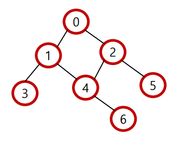
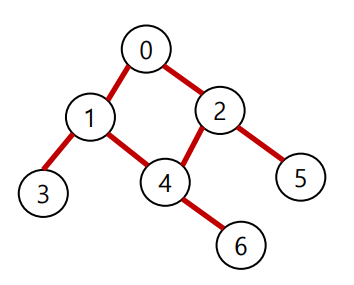
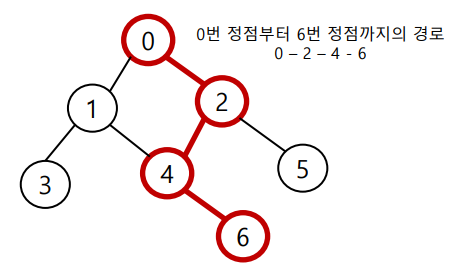
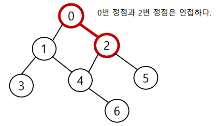

# 그래프

#그래프 #종류 #표현

1. ## 그래프에 대한 이해

   > 정점(Vertex)과 이를 연결하는 간선(Edge)들의 집합으로 이루어진 비선형 자료구조

   - 그래프 관련 용어

     - **정점(Vertex)** : 간선으로 연결되는 객체이며, 노드라고도 한다.

       

     - **간선(Edge)** : 정점 간의 관계를 표현하는 선을 의미한다.

       

     - **경로(Path)** : 시작 정점부터 도착 정점까지 거치는 정점을 나열한 것

       

     - **인접(Adjacency)** : 두 개의 정점이 하나의 간선으로 직접 연결된 상태

       

   

2. ## 그래프의 종류

   1. ### 무방향 그래프(Undirected Graph)

      > 간선의 방향이 없는 가장 일반적인 그래프
      >
      > 간선을 통해 양뱡향의 정점 이동 가능
      >
      > 차수 : 하나의 정점에 연결된 간선의 개수

   2. ### 유방향 그래프(Directed Graph)

      > 간선의 방향이 있는 그래프
      >
      > 간선이 방향을 가리키는 정점으로 이동
      >
      > 차수 : <u>진입 차수</u>와 <u>진출 차수</u>로 나누어짐

   

3. ## 그래프의 표현

   1. ### 인접 행렬

      > 두 정점을 연결하는 간선이 없으면 0, 있으면 1을 가지는 행렬로 표현하는 방식

      |      |  0   |  1   |  2   |  3   |  4   |  5   |
      | :--: | :--: | :--: | :--: | :--: | :--: | :--: |
      |  0   |  0   |  1   |  1   |  0   |  0   |  0   |
      |  1   |  1   |  0   |  0   |  1   |  0   |  0   |
      |  2   |  1   |  0   |  0   |  0   |  1   |  0   |
      |  3   |  0   |  1   |  0   |  0   |  1   |  1   |
      |  4   |  0   |  0   |  1   |  1   |  0   |  0   |
      |  5   |  0   |  0   |  0   |  1   |  0   |  0   |

      

   2. ### 인접 리스트

      > 리스트를 통해 각 정점에 대한 인접 정점들을 순차적으로 표현하는 방식

      ```python
      # 인접 리스트 결과
      graph = [
      	[1, 2],
      	[0, 3, 4],
      	[0, 4, 5],
      	[1],
      	[1, 2, 6],
      	[2],
      	[4]
      ]
      ```

      > 인덱스 번호가 정점의 번호를 의미

   3. 인접 행렬 vs 인접 리스트

      > 인접 행렬은 직관적, 공간 낭비 심함
      >
      > 인접 리스트는 효율적, 자주 사용
      >
      > 각각의 필요에 따라서 사용
