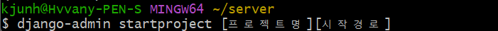

# Django 개발 환경 설정 가이드

#장고 #개발 #환경 #가이드


1.  git bash로 사용자 최상단 **홈**에 접근 (필수는 아니지만 이 위치가 관리 쉽다)

   

2. 서버 **프로젝트 저장소 만들기** 및 내부로 이동

   

3. 만들어준 서버 저장소에서 **가상 환경 생성**

   ```bash
   $ python -m venv [가상환경이름]
   ```

   

   

   -  `ls`는 파일이나 디펙토리 **목록을 나열**하기 위해서 사용하는 리눅스 커맨드입니다.

   

   - 저장소 내부에 어떤 파일 구조로 되어있는지 직접 이동해보며 파악하면 편하다.

   

   - `source`와 `.`은 **파일을 실행하는 명령어**입니다. 좀 이상하게 생기긴 했지만 `.`도 엄연한 하나의 명령어입니다.

     

     > source를 가상환경 내부에 scripts내부에 들어가서 activate를 해줘도 되지만 보통 최상단에서 바로 실행시키므로 위와같이 한번에 경로를 적어주어 실행시켜준다.

4. **pip 확인**

   -  **pip 개념**

     - **P**ip **I**nstalls **P**ackages의 약자

     - Python 패키지를 설치하고 관리하는 패키지 매니저(Package Manneger)

     - MacOS에서 brew, node의 npm, yarn, Linux에서 apt와 같은 개념의 패키지 매니저

     

5. **django 설치**

   

   - 여기서 최신 버전은 4 이지만 3버전 최종 버전을 다운 받는 이유가 있다.

     

     > 현업에서는 보통 프로그램의 가장 높은 버전이 나온지 얼마 안되었을 경우 큰 판올림 이전의 버전의 최종 버전을 많이 사용한다. 많은 버그가 잡힌 안정적인 버전이기 때문에!!!

     >  장고 LTS 버전은 Long Term Support release 의 약자로 장기 지원 버전을 의미한다. 안정적이여서 많이 사용을 하기 때문에 버전 지원을 오랫동안 한다. 

     

     > 설치 완료 확인!!!

6. **장고 실행**




> server-venv : 가상환경 파일
>
> first_pjt : 장고 프로젝트 파일
>
> manage.py : 서버 실행 파일


7. **서버 구동**


8. **로컬 호스트 확인**

> localhost:8000 입력

.png)


---


9. **앱 생성**

   ```bash
   python manage.py startapp articles
                          # 앱이름은 복수형 추천
   ```

10. **templates 생성**

    ```bash
    mkdir templates
    ```

    > 여러 어플 생성해도 templates 폴더는 하나로 묶인다.

    
