# Git Flow

#git #git_flow #branch #git_hub #pull_request #clone #merge


## Branch

​	**`나뭇가지`**처럼 메인 줄기에서 뻗어나가 서로 영향을 받지 않고 작업하고 다시 병합되는 구조

	

> 브랜치의 구조 ( 출처 : https://miro.medium.com/max/1400/1)

> **Master(main)** : 배포 가능한 상태
>
> **Develop(main)** : 개발 진행 중인 상태
>
> **Hotfix(supporting)** : 배포한 버전에 문제가 있을 때 신속하게 대응하기 위함
>
> **Feature(supporting)** : 기능별 개발 (ex 네이버 웹툰, 네이버 파이낸셜 등 )
>
> **Release(supporting)** : 개발 완료 이후 QA/Test 통해 얻은 정보로 minor bug fix 위함


### Branch basic commands

  1. #### 생성

     ```bash
     (master)$ git branch branch_name
     ```

     

  2. #### 이동

     ```bash
     (master)$ git checkout branch_name
     ```

     

  3. #### 생성 및 이동

     ```bash
     (master)$ git checkout -b branch_name
     ```

     

  4. #### 목록

     ```bash
     (master)$ git branch
     ```

     

  5. #### 삭제

     ```bash
     (master)$ git branch -d branch_name
     ```


6. #### 그래프 확인

   ```bash
   (master)$ git log --oneline --graph
   ```

   


### Branch Merge

​	각 branch에서 작업을 한 이후 버전을 합치기 위해서는 일반적으로 **`merge`** 명령어를 사용한다

- #### Merge 명령어

  ```bash
  (master)$ git merge branch_2_name      "branch_2 를 master 에 merge 하겠다"
  ```

  

1. #### 기존 master 브랜치에서 쭉 하나의 줄기로 나가는 경우

​		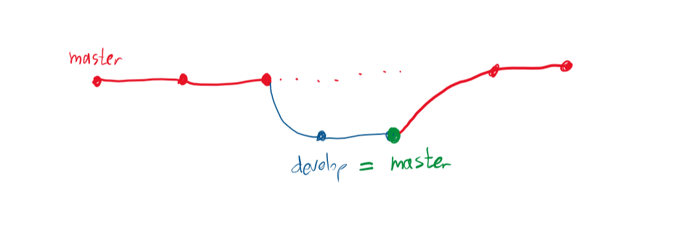

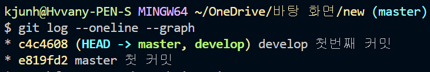

> **서로 다른 branch 에서 커밋을 하여 합쳤지만 가지가 하나이다**


2. #### 서로 다른 branch로 뻗어나갔지만 수정 파일이 겹치지 않는 경우

​		

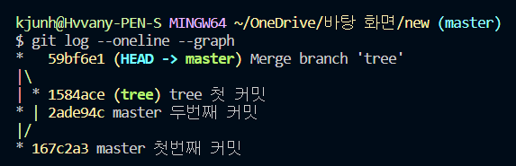

> **서로 다른 가지에서 작업을 하였지만 파일이 겹치지 않아 충돌없이 바로 merge 된다**


3. #### 서로 다른 branch로 뻗어나가서 같은 파일을 수정한 경우

​		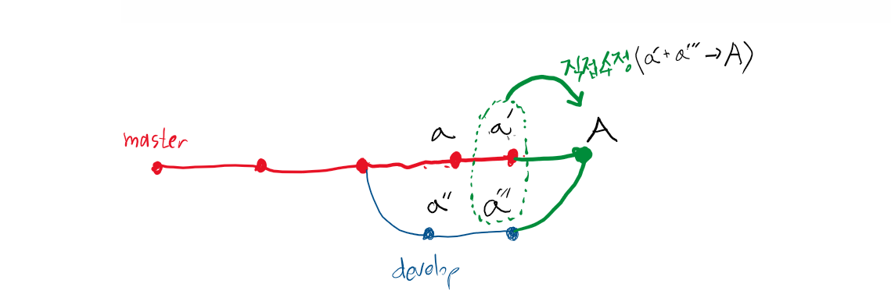

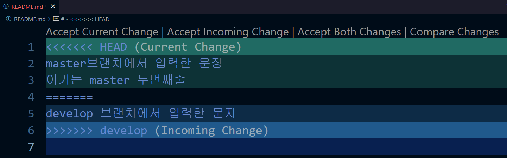

> 각 브랜치에서 README.md 파일을 다르게 수정하였다. 서로 다른 변경점을 표시해준다. 우리가 직접 파일을 고쳐서 저장해준다.

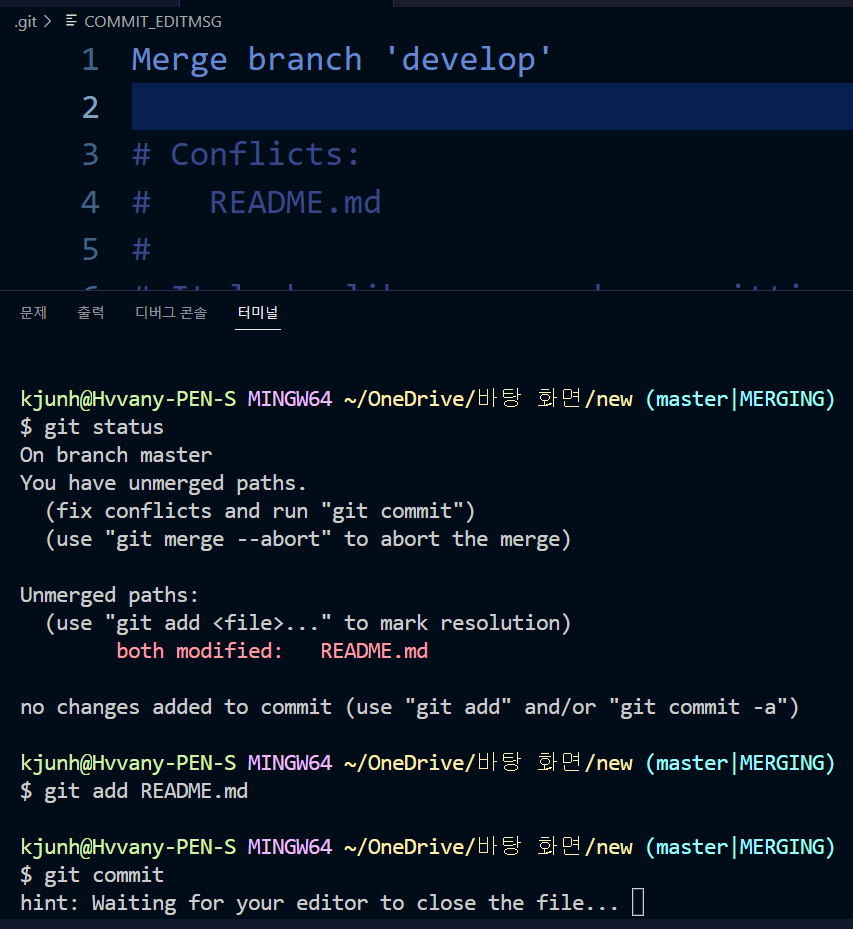

> 파일을 고치고 저장한 후 add 그리고 commit을 해준다
>
> 여기서 commit을 할 때 커밋메시지를 따로 입력하지 않고 엔터를 치면 vs code 편집기에 메시지가 뜬다
>
> 메시지 창을 닫아주면 merging 모드가 종료되면서 커밋이 완료 된다

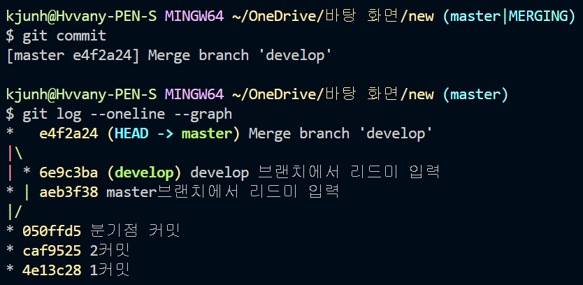

> 결국 2번째 경우와 같은 branch 모양이다. 중간에 merge가 자동으로 되는가 직접 우리가 개입을 해야하는가로 구분된다


> # GitHub Flow 기본 원칙
>
> 1. master branch는 반드시 배포 가능한 상태여야 한다.
> 2. feature branch는 각 기능의 의도를 알 수 있도록 작성한다.
> 3. Commit message는 매우 중요하며, 명확하게 작성한다.
> 4. Pull Request를 통해 협업을 진행한다.
> 5. 변경사항을 반영하고 싶다면, master branch에 병합한다.


## 원격저장소 설정 기본 명령어

```bash
$ git clone url   "원격 저장소 복제"

$ git remote -v   "원격 저장소 정보 확인"

$ git remote add origin url   "원격 저장소 추가"

$ git remote rm origin   "원격 저장소 삭제"

$ git push origin branch_name   "원격 저장소에 push"

$ git pull origin branch_name   "원격 저장소로부터 pull"
```


## Fork

포크로 폭 떠오듯이 다른 사람의 원격 repository가 나의 원격 repository로 그대로 넘어오는 것이다

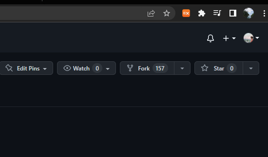


## Clone

원격 repository에서 나의 로컬 repository로 복사해오는 것

> 다른 사람의 원격 repository에서 clone을 해도 수정본을 push할 권한이 없으므로 
>
> 보통 나의 원격  repository로 fork한 후 나의 로컬 repository로 clone한다

```bash
$ git clone url
```


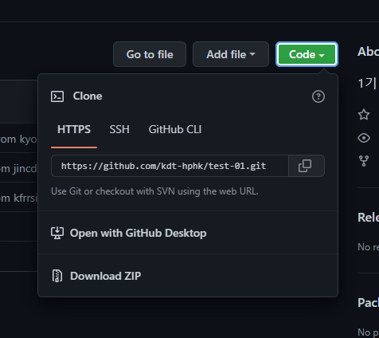

>  **※주의할점**
>
> clone을 할 때 링크를 복사하여  git clone url 을 해야 .git 폴더까지 복사가 되어 커밋 기록이 그대로 넘어온다
>
> ZIP 파일로 다운받으면 커밋 기록은 없이 현재 파일들만 넘어온다


## Pull Request

프로젝트를 진행할 때 수정한 파일을 최고 관리자에게 확인 후 pull과 merge를 요청하는 작업

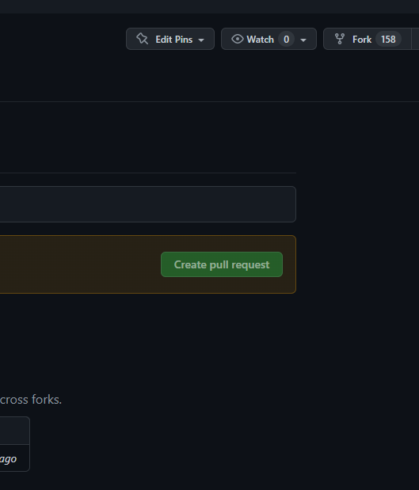

자동으로 초록 버튼이 생성되기도 하지만 안뜰때는 직접 pull request에 들어가서 만들어주면 된다


# 개념 정리

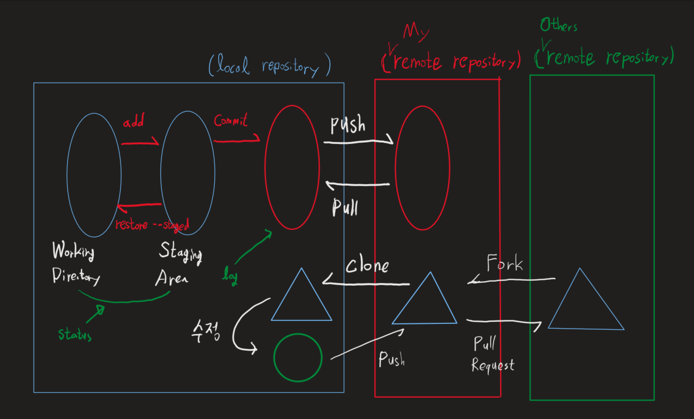
