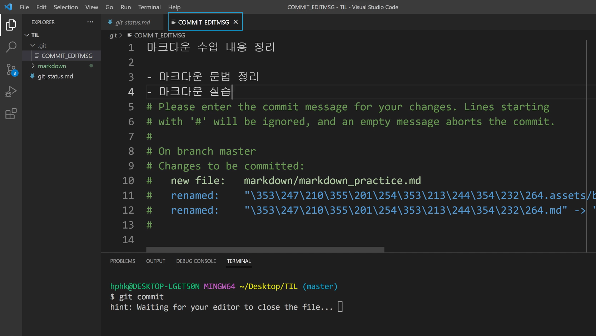
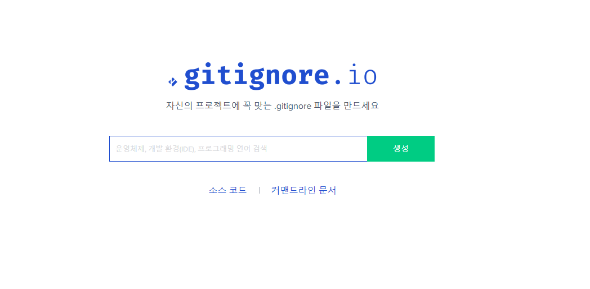

# Git & GitHub


## 원격저장소 (Remote Repository)

​	네트워크를 활용한 저장소

​	GitHub, GitLab, Bitbucket 등이 있다


[가장 대표적이고 인기있는 깃허브]


## 원격저장소 기본 흐름

### 	원격저장소 생성

> ### 1. New repository


> ### 2. Repository setting


> ### 3. Check


> 코드 안에서 CLI를 위해 미리 작성해놓은 명령어가 있다
>
>  git remote add origin 주소    => 복사해서 git 사용시 이용


### 로컬저장소  설정

1. #### visual studio code 기본 에디터 설정

   기본 에디터는 vim 이지만 편리성을 위해 설정

   ```visual basic
   $ git config --global core.editor "code --wait"
   ```

   > 로컬 저장소 생성 시 한 번만 설정하면 된다
   >
   > 저장소마다 모두 설정하면 된다

   

2. #### 원격저장소 경로 설정

   ```visual basic
   $ git remote add origin 원격저장소 주소
   
   => git아 원격저장소 추가해줘 오리진이라는 이름을 가진 이 url을~
   ```

   > 로컬 저장소 생성 시 한 번만 설정하면 된다
   >
   > 저장소마다 모두 설정하면 된다

   

   ##### 경로확인

   ```visual basic
   $ git remote -v
   
   원격 저장소의 정보 확인 
   ```

   

   

3. #### 원격저장소 활용 명령어

   1. Push

      ```visual basic
      $ git push <원격저장소이름> <브랜치이름>
         
      현재 원격저장소 이름은 origin 브랜치는 1개
      $ git push origin master
      ```
      
      > psuh 할 때 최초 로그인 필요
      
      
   
4. #### 커밋메시지 중요

   

​		`git commit -m` 을 입력했었지만 더 길게 작성하고 싶으면 -m을 입력하지 않고 에디터 창에서 적어주면 된다.

​		커밋메시지는 `일관성`있게 작성하자


5. #### 버전 관리랑 상관없는 파일

   `.gitignore`파일생생 

   > 작성 예시
   >
   > 특정 파일 : a.txt
   >
   > 특정 디렉토리 : /my_secret
   >
   > 특정 확장자 : *.exe                   => asterisk는Wildcard=모든것 의미
   >
   > 예외 처리 : !b.exe

   서로 개발 환경이 달라 공유할 필요 없는 파일들을 등록해 놓으면 된다

   깃헙이나 구글에 잘 보면 개발자들이 정리해놓은 예외 파일들이 있다

   

   [](https://www.toptal.com/developers/gitignore/)

> [이미지 클릭하면 링크 이동]

