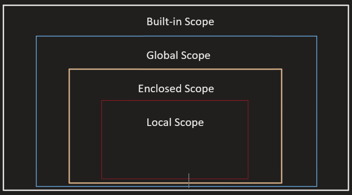

# Python 함수


## 함수 기초

### 함수

- 특정한 기능을 하는 코드의 조각
-  특정 명령을 수행하는 코드를 매번 다시 작성하지 않고, 필요 시에만 호출하여 간편하게 사용
-  코드 중복 방지, 재사용 용이

### 사용자 함수

- 구현되어 있는 함수가 없는 경우, 사용자가 직접 함수를 작성

  ```python
  def function_name:
      # Code Block
      return returning_value
  ```


## 함수 기본 구조

- 선언과 호출
- 입력
- 범위
- 결과값

### 선언과 호출

- 함수의 선언은 def 키워드 활용

- 들여쓰기를 통해 Function body 작성

- 함수는 parameter 넘겨줄 수 있음

- 함수는 동작 후에 return통해 결과값 전달

- 함수는 함수명()으로 호출

  ```python
  def foo():
      return True
  def add(x,y):
      return x + y
  ```

- 예시

  ```python
  num1 = 0
  num2 = 1
  
  def func1(a,b):
      return a + b
  
  def func2(a,b):
      return a - b
  def func3(a,b):
      return func1(a,5) + func2(5.b)
  
  result = func3(num1, num2)
  print(result)
  
  # 9 출력
  ```


### 함수의 입력

- ### Parameter

  > 함수를 실행할 때, 함수 내부에서 사용되는 식별자

- ### Argument

  > 함수를 호출할 때, 넣어주는 값

  - **Positional arguments**(기본값)

    ```python
    def add(x, y):    # add(2, 3)
        return x + y
    ```

  - **Keyword arguments**

    ```python
    def add(x, y):    # add(x=2, y=5)
        return x + y  # add(2, y=5)
    # add(x=2, 5) => 이거는 불가능!! keyword 쓰는 순간 뒤에는 positional 불가
    ```

    

  - **Default Arguments Values**
  
    > 기본값을 지정하여 함수 호출 시 argument 값을 설정하지 않도록 함
  
    ```python
    def add(x, y=0):   # add(2)
        return x + y
    ```
  
  - 정해지지 않은 개수의 **arguments**
  
    ```python
    def add(*args):        # add(1,2,3,4,5,6,...,99)
        for arg in args:
        	print(arg, end="")    # 1 2 3 4 ... 99
    ```
  
  - 정해지지 않은 개수의 **keyword arguments**
  
    ```python
    def family(**kwargs):        # family(father='John', mother='Jane')
        for key, value in kwargs:
            print(key, ":", value)  # father : 'John'  mother : 'Jane'
    ```
  
    

### 함수의 결과값

- ### return

  - 함수는 반드시 값을 **<u>하나만 return 한다.</u>**
  - 함수는 return과 동시에 실행이 종료된다.

  ```python
  def minus_and_product(x, y):
      return x - y     # x - y 반환 후 종료
  	return x + y    # 실행 안됨
  ```

  - 두 개 이상의 값을 반환하는 방법?

  ```python
  def minus_and_product(x, y):
      return x - y, x * y    # 튜플 반환
  
  minus_and_product(4, 5)   
  # (-1, 20)   튜플
  ```

  - return vs print

    return은 함수 안에서 값을 반환하기 위해 사용되는 키워드, print는 출력 기능의 함수

### 함수의 범위

- 함수는 코드 내부에 local scope를 생성하며, 그 외의 공간인 global scope로 구분

- scope

  - global scope : 코드 어디에서든 참조할 수 있는 공간
  - local scope : 함수가 만든 scope. 함수 내부에서만 참조 가능

- variable

  - global variable : global scope에 정의된 변수
  - local variable : local scope에 정의된 변수

- 객체 수명 주기

  - 객체는 각자의 수명주기가 존재

    - built-in scope

      영원히

    - global scope

      모듈이 호출된 시점 이후 혹은 인터프리터 끝날 때까지 유지

    - local scope

      함수가 호출될 때 생성되고, 함수가 종료될 때까지 유지

  ```python
  def func():
      a = 20
      print('local', a)
      
  func()
  print('global', a)
  # local 20
  # error  -> local에서만 a 존재
  ```

- 이름 검색 규칙

  > 파이썬에서 사용되는 이름들은 이름공간(namespace)에 저장되어 있음

  > 아래와 같은 순서로 이름을 찾아나가며, LEGB Rule 이라고 부름

  1. Local scope : 함수
  2. Enclosed scope : 특정 함수의 상위 함수
  3. Global scope : 함수 밖의 변수, Import 모듈
  4. Built-in scope : 파이썬 안에 내장되어 있는 함수 또는 속성

  


## 함수 응용

- ### 내장 함수 응용

  - map(function, iterable)

    - 순회 가능한 데이터구조의 모든 요소에 함수 적용하고, 그 결과를 map object로 반환

    ```python
    numbers = [1, 2, 3]
    result = map(atr, numbers)
    print(result, type(result))
    # <map object at  0x10e2ca100> <class 'map'>
    print(list(result))    # => 리스트에 담아야 확인 가능!
    # ['1', '2', '3']
    ```

    - 알고리즘 문제에서 입력값을 바로 정수형으로 받고 싶을때

    ```python
    n, m = map(int, input().split())
    ```

    
