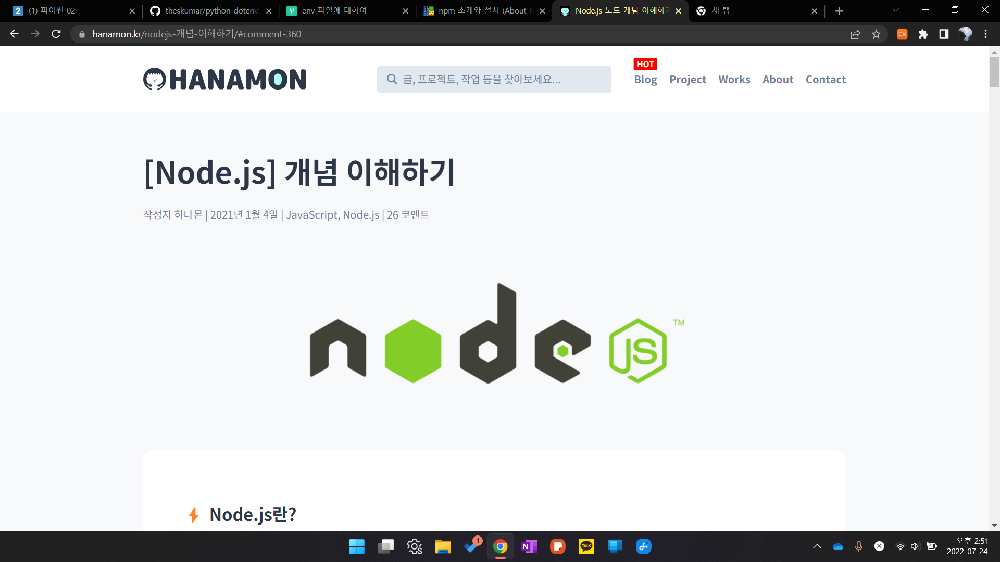

# Review Project 2

#python #api #project #codereview


1. ## API문서와 requests 연습

   - 아래의 문서를 활용하여 BTC(비트코인)의 KRW(원) 전일종가를 출력하시오.
   - https://apidocs.bithumb.com/reference/현재가-정보-조회

   > 결과 예시

   ```python
   29812000
   ```

   > 내 코드

   ```python
   import requests
   
   
   def get_btc_krw():
       order_currency = "BTC"
       payment_currency = "KRW"
       url = f"https://api.bithumb.com/public/ticker/{order_currency}_{payment_currency}"
   
       res = requests.get(url=url).json()
       data = res["data"]
       prev_closing_price = data["prev_closing_price"]
   
       return prev_closing_price
   
   
   if __name__ == "__main__":
       print(get_btc_krw())
   ```

   

2. ## 인기 영화 조회

   - 인기 영화 목록의 개수를 출력합니다.
   - requests 라이브러리를 활용하여 TMDB에서 현재 인기 있는 영화 목록(Get Populations) 데이터를 요청합니다.
   - 응답 받은 데이터 영화 개수를 반환하는 함수를 작성합니다.

   > 결과 예시

   ```json
   20
   ```

   > 내가 작성한 코드

   ```python
   import requests
   
   
   def popular_count():
       pass 
       # 여기에 코드를 작성합니다.  
       base_url = 'https://api.themoviedb.org/3'
       path = '/movie/popular'
       params = {
           'api_key': 'e2be94a1762b4b81af8b205d5e2bcb5f',
           'language': 'ko-KR'
       }
       response = requests.get(base_url+path, params=params).json()
       results = response['results']
   
       return len(results)
   
   
       #아래의 코드는 수정하지 않습니다.
   if __name__ == '__main__':
       """
       popular 영화목록의 개수 반환
       """   
       print(popular_count())
       #20
   ```

   

   > 전공자 작성 코드

   ```python
   import requests
   from dotenv import load_dotenv
   import os
   
   load_dotenv()
   API_KEY_TOKEN = os.getenv('my_api_key')
   
   def popular_count():
       pass 
       # 여기에 코드를 작성합니다.
       BASE_URL = 'https://api.themoviedb.org/3'
       path = '/movie/popular'
       params = {
           'api_key': API_KEY_TOKEN,
           'language': 'ko-KR'
       }
   
       response = requests.get(BASE_URL+path, params=params).json()
       result = response.get('results')
       return len(result)
   
   
   # 아래의 코드는 수정하지 않습니다.
   if __name__ == '__main__':
       """
       popular 영화목록의 개수 반환
       """
       print(popular_count())
       # 20
   ```

   > 코드 리뷰

   - ### env

     - #### `.env`파일이란?

       - git, 오픈소스에 올리면 안되는 값 존재한다. 사용자 API 키 값 같은!
       - 이때 필요한 것이 **dotenv 패키지** 이며 환경변수 파일을 외부에 만들어 URL,포트, API_KEY등.. 을 저장시켜 소스코드 내에 하드코딩하지 않고 사용 할 수 있다.

     - #### 프로젝트 최상위 루트에 파일 저장

       - 외부 파일(.env)에 환경변수를 정의하여 변수로 받아오는 이유는 보안과 유지보수에 용이하기 때문

     - #### `.env` 파일 사용법

       - .env.{mode명}
       - .env.--- 파일의 내용을 수정하면 npm 으로 다시 시작해야합니다.
       - 

   

   

   

   

3. ## 특정 조건에 맞는 인기 영화 조회

4. ## 특정 조건에 맞는 인기 영화 조회

5. ## 영화 조회 및 추천 영화 조회

6. ## 출연진 및 연출진 데이터 조회

7. 


> 코드 리뷰

- ### env

  - #### `.env`파일이란?

    - git, 오픈소스에 올리면 안되는 값 존재한다. 사용자 API 키 값 같은!
    - 이때 필요한 것이 **dotenv 패키지** 이며 환경변수 파일을 외부에 만들어 URL,포트, API_KEY등.. 을 저장시켜 소스코드 내에 하드코딩하지 않고 사용 할 수 있다.

  - #### 프로젝트 최상위 루트에 파일 저장

    - 외부 파일(.env)에 환경변수를 정의하여 변수로 받아오는 이유는 보안과 유지보수에 용이하기 때문

  - #### `.env` 파일 사용법

    - .env.{mode명}
    - .env.--- 파일의 내용을 수정하면 npm 으로 다시 시작해야합니다.

  - #### 파이썬에서 사용하기

    [깃허브 dotenv](https://github.com/theskumar/python-dotenv)

    1. getting started

       ```bash
       pip install python-dotenv
       ```

       직접 environment variables 들을 정의 하는 것은 매우 비효율 적이다. 그래서 dotenv를 사용하자.

       ```python
       from dotenv import load_dotenv
       
       load_dotenv()  # take environment variables from .env.
       
       # Code of your application, which uses environment variables (e.g. from `os.environ` or
       # `os.getenv`) as if they came from the actual environment.
       ```

       위의 명령어를 통해 env파일에서 환경 변수를 가져온다.

- ### npm

  - #### `npm`이란?

    - Node Package Manager의 약자

    - node.js에서 사용하는 모듈들을 패키지로 만들어 npm을 통하여 관리하고 배포하고 있다.

      이게 무엇을 의미하냐면 다른 사람이 잘 만들어놓은 모듈들을 npm을 통하여 설치하여 사용이 가능하다는 점이다. 또한 이 모듈이 사용하고있는 다른 모듈의 의존성 또한 자동으로 해결해준다.

      어떻게? **`npm install`** 이 명령어 한번으로!!!

- ### node.js

  - #### node.js란?

    - `Node.js`는 Chrome V8 JavaScript 엔진으로 빌드 된 JavaScript 런타임

    - 즉, 노드를 통해 **다양한 자바스크립트 애플리케이션을 실행**할 수 있으며, 서버를 실행하는 데 제일 많이 사용된다.

      - Node.js는 JavaScript를 **서버**에서도 사용할 수 있도록 만든 프로그램이다.
      - Node.js는 V8이라는 **JavaScript 엔진 위에서 동작**하는 **자바스크립트 런타임**(환경)이다.
      - Node.js는 서버사이트 **스크립트 언어가 아니다**. 프로그램(환경)이다.
      - Node.js는 **웹서버**와 같이 확장성 있는 네트워크 프로그램을 제작하기 위해 만들어졌다.

      Node.js는 확장성이 있는 네트워크 어플리케이션 개발에 사용되는 소프트웨어 플랫폼이다. 특히 **서버사이트에서 많이 사용**되고 있다.
      사용되는 언어로는 자바스크립트(Javascript)를 활용하며, Non-blocking I/O와 단일 스레드 이벤트 루프를 통한 높은 처리 성능을 가지고 있는 것이 특징이다.

    - **좀 더 쉽게 정리**

      > - Node.js를 사용하려면 먼저 JavaScript를 배워야한다.
      > - Node.js는 JavaScript를 사용하기 위해 만들어진 것이기 때문이다.
      > - JavaScript는 C/C++, Java 와 같은 프로그래밍 언어이다.
      > - 하지만 이름에서 알 수 있듯 JavaScript는 독립적인 언어가 아닌 스크립트 언어이다.
      > - 스크립트 언어는 특정한 프로그램 안에서 동작하는 프로그램이기 때문에 웹 브라우저 프로그램 안에서만 동작을 한다.
      > - 즉, 웹 브라우저(크롬, 사파리, 익스플로러, 파이어폭스 등)가 없으면 사용할 수 없는 프로그램이다.
      > - 여기서 Node.js가 나오는 이유가 된다.
      > - 즉, JavaScript 를 웹 브라우저에서 독립시킨 것으로 Node.js를 설치하게 되면 터미널프로그램(윈도우의 cmd, 맥의 terminal 등)에서 Node.js를 입력하여 브라우저 없이 바로 실행할 수 있다.
      > - 하지만 JavaScript에서 분리된 언어이기 때문에 문법은 같다.
      > - 이렇게 Node.js를 이용하여 웹 브라우저와 무관한 프로그램을 만들 수 있게 되었다.
      > - 중요한 것은 Node.js를 이용하여 **서버를 만들 수 있다**는 것이다.
      > - 중요한 이유는 이전까지 Server-Client 웹사이트를 만들 때 웹에서 표시되는 부분은 JavaScript 를 사용하여 만들어야만 했으며, 서버는 Reby, Java 등 다른 언어를 써서 만들었어야 했는데 마침내 **한 가지 언어로 전체 웹 페이지를 만들 수 있게 된 것**이다.

    - **자바스크립트 런타임?**

      > - **런타임**이란 특정 언어로 만든 **프로그램을 실행할 수 있는 환경**을 뜻한다.
      > - 따라서 노드는 자바스크립트 프로그램을 컴퓨터에서 실행할 수 있게 하는 자바스크립트 실행기이다.
      > - 특히 2008년 구글이 V8 엔진을 사용하여 크롬을 출시했고 V8 엔진은 다른 자바스크립트 엔진과 달리 매우 빨라 라이언 달(Ryan Dahl)은 2009년 V8 엔진 기반의 **노드 프로젝트**를 시작하며 세상에 나왔다.

    - **이벤트 기반**

      > - 노드는 V8과 더불어 libuv라는 라이브러리를 사용한다.
      > - libuv 라이브러리는 노드의 특성인 **이벤트 기반, 논 블로킹 I/O 모델**을 구현하고 있다.
      > - **이벤트 기반(Event-driven)**이란 이벤트가 발생할 때 미리 지정해둔 작업을 수행하는 방식을 의미한다.
      > - 즉, 이벤트 기반 시스템에서는 특정 이벤트가 발생할 때 무엇을 할지 미리 등록해두고, 이를 이벤트 리스너에 콜백함수를 등록한다.
      > - 이후 이벤트가 발생하면 리스너에 등록해둔 콜백함수를 호출하며, 이벤트가 끝난 후 노드는 다음 이벤트가 발생할 때까지 대기한다.

    - **이벤트 루프**

      > - 이벤트 루프(event loop)는 여러 이벤트가 동시에 발생했을 때 어떤 순서로 콜백함수를 호출 할지를 이벤트 루프가 판단한다.
      > - 노드는 이벤트가 종료될 때까지 이벤트 처리를 위한 작업을 반복하므로 루프(loog)라고 부른다.

    - **논 블로킹 I/O**

      > - 이벤트 루프를 잘 활용하면 오래 걸리는 작업을 효율적으로 처리할 수 있다.
      > - 작업에는 두 가지 종류가 있는데 동시에 실행될 수 있는 작업과 동시에 실행될 수 없는 작업이다.
      > - 특히 파일 시스템 접근, 네트워크를 통한 요청 작업은 입력(Input)/출력(Output)의 일종이며,
      > - 이러한 작업을 할 때 노드는 비동기 방식으로 블로킹을 만들지 않게 끔(논 블로킹) 처리한다.
      > - **비동기**이란 이전 작업이 완료될 때까지 대기하지 않고 동시에 작업을 수행한다.
      > - 반대로 **동기**는 이전 작업이 끝나야만 다음 작업을 수행한다.
      > - 자세하게 풀어서 아야기하면 함수 호출 시 당장 실행하는 것이 아니라(동기→블로킹) 일단 어느 곳에 쌓아 놓고 동시에 요청을 처리하고(비동기→논 블로킹) 요청이 완료된 순서대로처리(스택 이용) 한다는 말이다.

    - **싱글 스레드**

      > 이벤트 기반, 논 블로킹 모델과 더불어 노드를 설명하는 키워드 중 하나는 **싱글 스레드**이다.
      > 자바스크립트 코드는 동시에 실행될 수 없는데 그 이유는 노드가 싱글 스레드 기반이기 때문이다.
      >
      > - **프로세스 :** 운영체제에서 할당하는 작업의 단위이다. 노드나 웹 브라우저 같은 프로그램은 개별적인 프로세스이다. 프로세스 간에는 메모리 등의 자원을 공유하지 않는다.
      > - **스레드 :** 스레드는 프로세스 내에서 실행되는 흐름의 단위이다. 프로세스는 스레드를 여러 개 생성해 여러 작업을 동시에 처리할 수 있다. 스레드들은 부모 프로세스의 자원을 공유한다. 같은 주소의 메모리에 접근 가능하므로 데이터를 공유할 수 있다.
      >
      > Node.js는 싱글스레드, 논 블로킹 모델로 싱글 스레드가 혼자서 일을 처리하지만 들어오는 요청 순서가 아닌 논 블로킹 방식으로 이전 작업이 완료될 때까지 대기하지 않고 다음 작업을 수행한다.

    - **결론**

      노드는 기본적으로 싱글 스레드, 논 블로킹 모델을 채용하므로 I/O 요청이 많이 발생하면 노드를 서버로 사용하는 것이 좋다. 하지만 노드는 CPU 부하가 큰 작업에는 적합하지 않다.

      우리가 작성하는 코드는 모두 스레드 하나에서 처리되기 때문에 코드가 CPU 연산을 많이 요구하면 스레드 하나가 혼자서 감당하기 어렵다.

      즉, 개수는 많지만 크기는 작은 데이터를 실시간으로 주고받는데 노드는 적합하다. 예를 들어 네트워트나 데이터베이스, 디스크 작업 같은 I/O에 특화되어있다. 실시간 채팅 애플리케이션, 주식 차트도 포함된다.

      결론적으로 노드의 **`장점`**은 

      1. 멀티 스레드 방식에 비해 **적은 컴퓨터 자원을 사용**한다. 

      2. **I/O 작업이 많은 서버**로 적합하다. 

      3. **웹 서버가 내장**되어 있어 별도의 웹서버를 설치할 필요가 없다. 

      4. 자바스크립트를 사용하기 때문에 **JSON 형식과 쉽게 호환**된다.


출처

---

1. 하나몬 블로그

   

> 설명을 잘 해주신다. 앞으로 자주 들릴듯!
