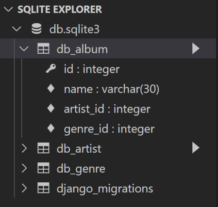

# ORM2

#sql #sqlite #django #객체지향


## 1.QuerySet API

※ 파이썬 메서드 호출 시

> add( 1, 2 )  ,  add( a=1, b=2 ), add( 1, b=2 ) 처렴 가능했다.
>
> 비슷한 개념으로 id__gt=4 형태로 사용한다.  부등호 사용 못하는 이유.

- gt (greater than) 초과

  ```python
  Entry.objects.filter(id__gt=4)     # python orm
  ```

  ```sql
  SELECT ... WHERE id > 4;           # sql
  ```

- gte (greater than equal) 이상

  ```python
  Entry.objects.filter(id__gte=4)     # python orm
  ```

  ```sql
  SELECT ... WHERE id >= 4;           # sql
  ```

- lt, lte

  ```python
  Entry.objects.filter(id__lt=4)       # python orm
  Entry.objects.filter(id__lte=4)
  ```

  ```sql
  SELECT ... WHERE id < 4;              # sql
  SELECT ... WHERE id <= 4;
  ```

- in

  ```python
  Entry.objects.filter(id__in=[1, 3, 4])
  Entry.objects.filter(headline__in='abc')
  ```

  ```sql
  SELECT ... WHERE id IN (1, 3, 4);
  SELECT ... WHERE headline IN ('a', 'b', 'c');
  ```

- startswith

  ```python
  Entry.objects.filter(headline__startswith='Lennon')
  ```

  ```sql
  SELECT ... WHERE headline LIKE 'Lennon%';
  ```

- istartswith

  ```python
  Entry.objects.filter(headline__istartswith='Lennon')
  ```

  ```sql
  SELECT ... WHERE headline ILIKE 'Lennon%';
  ```

  > insensitive  => 대소문자 구분 없이

- endswith

  ```python
  Entry.objects.filter(headline__endswith='Lennon')
  Entry.objects.filter(headline__iendswith='Lennon')
  ```

  ```sql
  SELECT ... WHERE headline LIKE '%Lennon';
  SELECT ... WHERE headline ILIKE '%Lennon';
  ```

- contains

  ```python
  Entry.objects.get(headline__contains='Lennon’)
  Entry.objects.get(headline__icontains='Lennon’)
  ```

  ```sql
  SELECT ... WHERE headline LIKE '%Lennon%’;
  SELECT ... WHERE headline ILIKE '%Lennon%';
  ```

- range

  ```python
  import datetime
  start_date = datetime.date(2005, 1, 1)
  end_date = datetime.date(2005, 3, 31)
  Entry.objects.filter(pub_date__range=(start_date, end_date))
  ```

  ```sql
  SELECT ... WHERE pub_date
  BETWEEN '2005-01-01' and '2005-03-31';
  ```

- 복합 활용

  ```python
  inner_qs = Blog.objects.filter(name__contains='Cheddar')
  entries = Entry.objects.filter(blog__in=inner_qs)
  ```

  ```sql
  SELECT ...
  WHERE blog.id IN (SELECT id FROM ... WHERE NAME
  LIKE '%Cheddar%’);
  ```

- 활용

  ```python
  Entry.objects.all()[0]
  ```

  ```sql
  SELECT ...
  LIMIT 1;
  ```

  ```python
  Entry.objects.order_by('id')
  ```

  ```sql
  SELECT ...
  ORDER BY id;
  ```

  ```python
  Entry.objects.order_by(‘-id')
  ```

  ```sql
  SELECT ...
  ORDER BY id DESC;
  ```

- ### .query

  > ORM에서 어떻게 쿼리문을 작성하는지 확인할 수 있다.
  >
  > 그런데 쿼리셋 말고 단일 객체에 적용하면 오류가 난다.

  ```python
  print(Genre.objects.all().query)
  # SELECT 'db_genre','id','db_genre','name' FROM 'db_genre'
  ```

  

  .png)

  > 에러나는 이유 : 개별 인스턴스에 .query를 사용하여서

  

## 2.ORM 확장( 1 : N )

- ### 모델링 (ORM)

  

  ```python
  class Genre(models.Model):
  	name = models.CharField(max_length=30)
      
  class Artist(models.Model):
  	name = models.CharField(max_length=30)
  	debut = models.DateField()
      
  class Album(models.Model):
  	name = models.CharField(max_length=30)
  	genre = models.ForeignKey('Genre', on_delete=models.CASCADE)
  	artist = models.ForeignKey('Artist', on_delete=models.CASCADE)
  ```

  > Class 안에는 genre 라고 적어주어야 데이터베이스에는 _id 가 붙어서 genre_id 가 된다.
  >
  > Class 안에서 genre_id라고 붙이면 데이터베이스에는 genre_id_id가 되어 이상해진다.

  

  - Foreign Key (왜래키)
    - 키를 사용하여 부모 테이블의 유일한 값을 참조 (참조 무결성)
    - 
