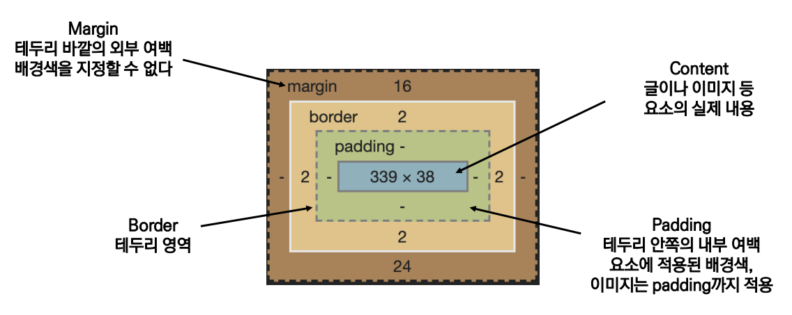
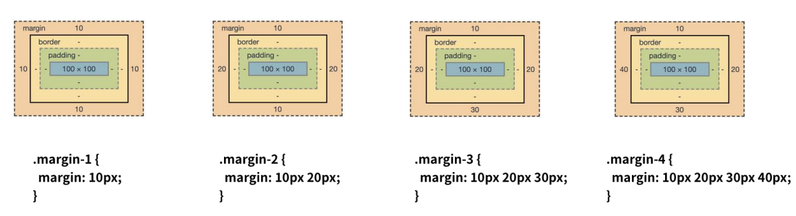

# CSS Box Model

#css #box_model #display 


## CSS 기본 스타일

### 크기 단위

- **px** (픽셀)
  
  - 모니터 해상도의 한 화소인 '픽셀' 기준
  - 픽셀의 크기는 변하지 않기 때문에 고정적인 단위
  
- **%** (퍼센트)
  
  - 백분율 단위
  - 가변적인 레이아웃에서 사용
  
- **em** (element)
  
  - 상속의 <u>영향을 받음</u>
  - 배수 단위, 요소에 지정된 사이즈에 상대적인 사이즈를 가짐
  
- **rem** (root element) 
  
  - 상속에 <u>영향 안받음</u>
  - 최상위 요소(html)의 사이즈를 기준으로 배수 단위를 가짐
  
  ```html
  <body>
  	<ul class="font-big">
  		<li class="em">2em</li>
  		<li class="rem">2rem</li>
  		<li>no class</li>
  	</ul>
  </body>
  ```
  
  ```css
  <style>
  	.font-big {
  		font-size: 36px;
  	}
  	.em {
  		font-size: 2em;
  	}
  	.rem {
  		font-size: 2rem;
  	}
  </style>
  ```

- **viewport**

  - 웹 페이지를 방문한 유저에게 바로 보이게 되는 웹 컨텐츠 영역
  - 디바이스의 viewport를 기준으로 상대적인 사이즈가 결정됨

  > ex) vw, vh, vmin, vmax
  >
  > **vw** : width 기준
  >
  > **vh** : height 기준
  >
  > **vmin** : 창의 가로 세로 중에서 작은 비율 쪽 기준
  >
  > **vmax** : 창의 가로 세로 중에서 큰 비율 쪽 기준

  ```html
  <body>
  	<h1 class="px">px사용</h1>
  	<h1 class="vw">vw사용</h1>
  </body>
  ```

  ```css
  <style>
  	h1 {
  		color: black;
  		background-color: pink;
  	}
  	.px {
  		width: 200px;
  	}
  	.vw {
  		width: 50vw;
  	}
  </style>
  ```


### 색상단위

- **생상  키워드**

  ```css
  p { color: black; }
  ```

  - 대소문자 구분하지 않음
  - red, blue, black과 같은 특정 색을 직접 글자로 나타냄

- **RGB 색상**

  ```css
  p { color: #000; }
  p { color: #000000; }
  p { color: rgb(0, 0, 0); }
  p { color: rgba(0, 0, 0, 0.5); }
  ```

  - 16진수 표기법 혹은 함수형 표기법을 사용해서 특정 색을 표현하는 방식

- **HSL 색상**

  ```css
  p { color: hsl(120, 100%, 0); }
  p { color: hsla(120, 100% 0.5);}
  ```

  - 색상, 채도, 명도를 통해 특정 색을 표현하는 방식

- **a는 alpha(투명도)**


### CSS 문서 표현

- **텍스트**

  - 서체 `font-family`
  - 서체 스타일 `font-style` ,  `font-weight`  등
  - 자간 `letter-spacing`
  - 단어간격 `word-spacing`
  - 행간 `line-height`

  등등 매우 다양. 검색하여 사용


## CSS Selectors (선택자)

### 선택자 유형

- **기본 선택자**
- **결합자(Combinators)**
- **의사 클래스//요소(Persudo Class)**
- **`요소` 선택자**
- **`클래스` 선택자**
- **`아이디` 선택자**


### CSS 적용 우선 순위

1. **`!important`** : 핵폭탄 같은 존재. 사용하면 html의 구조가 무너진다
2. **`인라인`**
3. **`id`**
4. **`class, 속성, pseudo-class`**
5. **`요소, pseudo-element`**
6. **`CSS 파일 로딩 순서`**

​	

### CSS 상속

> CSS 는 상속을 통해 부모 요소의 속성을 자식에게 상속한다

- 상속 되는 것
  - Text 관련 요소, opacity, visibility 등
- 상속 안되는 것
  - Box model 관련 요소, position 관련 요소

```html
<body>
	<p>안녕하세요! <span>테스트</span> 입니다.</p>
</body>
```

```css
<style>
	p {
		/* 상속됨 */
		color: red;
		/* 상속 안됨 */
		border: 3px solid black;
	}
	span {
	}
</style>
```


## CSS Box Model

### CSS 원칙1 

> 모든 요소는 네모이고, 위에서 아래로, 왼쪽에서 오른쪽으로 쌓인다





### CSS 원칙2

> display 에 따라 크기와 배치가 달라진다

- **대표적으로 활용되는 display**
  - **display: block**
    - <u>줄 바꿈</u>이 일어나는 요소
    - 화면 크기 <u>전체의 가로 폭을 차지</u>한다
    - 블록 레벨 요소 안에 인라인 레벨 요소가 들어갈 수 있음
  - **display: inline**
    - 줄 바꿈이 일어나지 않는 <u>행의 일부 요소</u>
    - <u>content 너비만큼</u> 가로 폭을 차지한다.
    - width, height, margin-top, margin-bottom을 지정할 수 없다.
    - <u>상하 여백은 line-height로 지정</u>한다.

- **블록 레벨 / 인라인 레벨 요소**

  - **블록** 레벨

    > div, ul, ol, li, p, hr, form 등

  - **인라인** 레벨

    > span, a, img, input, label, b, em, i, strong 등

- 기타 display

  - display: inline-block
    - block과 inline 레벨 요소의 특징을 모두 가짐
    - inline처럼 한 줄에 표시할 수 있고, block 처럼 width, height, margin 속성을 모두 지정 할 수 있음
  - display: none
    - 해당 요소를 화면에 표시하지 않고, 공간조차 부여되지 않음
    - 이와 비슷한 visibility: hidden은 해당 요소가 공간은 차지하나 화면에 표시는 안한다

  

  [이 외의 다양한 display 속성 링크]( https://developer.mozilla.org/ko/docs/Web/CSS/display)