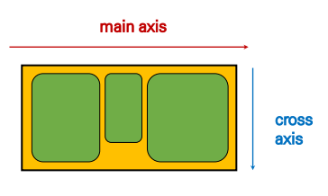
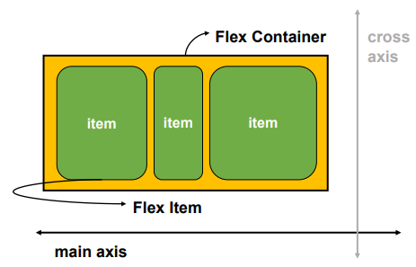

# CSS Flexbox

#css #position #float #flexbox #static #relative


## Position

0. ### Static

   > 모든 태그의 기본 

   - 일반적인 요소의 배치 순서에 따름(왼쪽 상단 기준)

   - 부모 요소 내에서 배치될 때는 **부모 요소의 위치를 기준**으로 배치 됨

1. ### Relative

   > 상대 위치

   - 자기 자신의 **static 위치(`본래 위치`)를 기준**으로 이동
   - static 일때와 **같은 공간 차지**하고 이동(**=normal flow 유지**)

2. ### Absolute

   > 절대 위치

   - **static이 아닌 가장 가까이 있는 `부모` 요소를 기준**으로 이동(없을시 body 기준)
   - 요소를 일반적인 문서 흐름에서 제거 후 이동(**=normal flow 벗어남**)

3. ### Fixed

   > 고정 위치

   - 부모 요소와 상관 없이 **viewport(`화면의 위치`)를 기준으로 이동**
   - 요소를 일반적인 문서 흐름에서 제거 후 이동(**=normal flow 벗어남**)

4. ### Sticky

   > 스크롤에 따라 static => fixed 로 변경


## Float

> 박스를 왼쪽 오른쪽으로 이동시켜 텍스트를 포함한 인라인 요소들이 주변을 wrapping 한다
>
> 한글 문서의 자리 차지하기 같은 개념?


## Flexbox

> Float으로는 조절하기 힘들었던 공백 및 정렬 기능을 제공한다

> 기존의 Float, Position의 한계 
>
> 1. 수직 정렬
> 2. 아이템의 너비와 높이, 간격을 일정하게 배치 힘듦

- **축**

  - main axis
  - cross axis

  

- **구성 요소**

  - Flex Container(부모)
  - Flex Item(자식)

  

### Flex 속성

- **배치**

  - flex-direction

  - flex-wrap

- **공간**

  - justify-content (main axis)
  - align-content (cross axis)

- **정렬**

  - align-items (모든 아이템)
  - align-self (개별 아이템)

#### flex-direction

> main axis 기준 방향 설정

1. row
2. row-reverse
3. column
4. column-reverse

#### flex-wrap

> 아이템이 컨테이너를 벗어나지 않도록 배치

1. wrap
2. nowrap
3. wrap-reverse

#### justify-content

> Main axis 를 기준으로 공간 배분

1. flex-start
2. flex-end
3. center
4. space-between
5. space-around
6. space-evenly

#### align-content

> Cross axis 를 기준으로 공간 배분 ( 아이템이 한 줄로 배치되면 확인할 수 없음 )

1. flex-start
2. flex-end
3. center
4. space-between
5. space-around
6. space-evenly

#### align-items

> 모든 아이템을 Cross axis 기준으로 정렬

1. stretch
2. flex-start
3. flex-end
4. center
5. baseline

#### align-self

> 개별 아이템을 Cross axis 기준으로 정렬

1. stretch
2. flex-start
3. flex-end
4. center

#### flex-grow & flex-order

- **grow** : 남은 영역 분배 비율
- **order** : 배치 순서

```css
<div class="flex_item grow-1 order-3">1</div>
<div class="flex-item grow-1">2</div>
<div class="flex-item order-1">3</div>
<div class="flex-item order-2">4</div>
```


#### 수직 수평 가운데 정렬

```css
/* 방법 1
컨테이너 설정
*/
.container {
	display: flex;
	justify-content: center;
	align-items: center;
	}
/* 방법 2
아이템 설정
*/
.container {
	display: flex;
}
.item {
	margin: auto;
}
```


## 스타일 가이드

[NHN style](https://nuli.navercorp.com/data/convention/NHN_Coding_Conventions_for_Markup_Languages.pdf) _ 구조적인 순서대로

[구글 HTML/CSS 스타일 가이드](https://google.github.io/styleguide/htmlcssguide.html) _ 알파벳 순서대로 => 찾아보기 쉽게