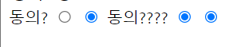

# Bootstrap

#table #form #input #bootstrap 

## 1. table

### **\<thead>, \<tbody>, \<tfoot>**

> \<table> 태그 안에 \<thead>, \<tbody>, \<tfoot> 태그로 테이블 크게 구조화 


### **tr > th, td**

> \<tr> 태그로 줄을 구분하고 그 내부에서 \<th>, \<td> 태그로 구성


### **colspan, rowspan**

> < td colsapn="2"> 형태로 셀 병합 가능

### **caption**

> \<caption>태그로 테이블 아래에 표 설명 및 제목 입력 가능


### HTML 코드 예시

```html
<body>
    <table>
      <thead>
        <tr>
          <th>ID</th>
          <th>Name</th>
          <th>Major</th>
        </tr>
      </thead>
      <tbody>
        <tr>
          <td>1</td>
          <td>홍길동</td>
          <td>Computer Science</td>
        </tr>
        <tr>
          <td>2</td>
          <td>김철수</td>
          <td>Business</td>
        </tr>
      </tbody>
      <tfoot>
        <tr>
          <td>총계</td>
          <td colspan="2">2명</td>
        </tr>
      </tfoot>
      <caption>
        1반 학생 명단
      </caption>
    </table>
  </body>
```


## 2. form & input


### [HTML 폼 가이드](https://developer.mozilla.org/ko/docs/Learn/Forms)

### [Learn Forms](https://web.dev/learn/forms/)


### form

> 정보를 서버에 제출하기 위해 사용하는 태그

#### 기본 속성

- `action` : form을 처리할 서버의 url
- `method` : form을 제출할 때 사용할 HTTP 메서드
- `enctype` : method가 post인 경우
  - 기본값 : application/x-www-form-urlencoded
  - 파일 전송시 : multipart/form-data

### input

> 다양한 타입을 가지는 입력 데이터 유형과 위젯이 제공됨

#### 기본 속성

- `name` : form control 에 적용되는 이름
- `value` : form control 에 적용되는 값
- required, readonly, autofocus, autocomplete, disabled 등

#### 일반 유형

- `text` : 일반 텍스트 입력
- `password` : 입력 시 값이 보이지 않고 특수 기호로 표현
- `email` : 이메일 형식이 아닌 경우 제출 불가
- `number` : min, max, step 속성을 활용하여 숫자 범위 설정 가능
- `file` : accept 속성을 활용하여 파일 타입 지정 가능

#### 항목 선택 유형

- `checkbox` : 다중 선택

- `radio` : 단일 선택

  > 옛날 라디오는 버튼을 하나만 누를 수 있었다.


#### 유의 사항



input의 name을 같게 해주어야 같은 name 중에서 하나만 선택 가능

**name이 다를 시 중복체크 가능해짐**

```html
<form action"/search" method="GET">
  <label type="agreement">동의?</label>
  <input type="radio" name="agreement" id="agreement">
  <input type="radio" name="agreement" id="disagreement">
  <label type="agreement">동의????</label>
  <input type="radio" name="disagreement" id="agreement">
  <input type="radio" name="diagreement" id="agreement">
</form>
```


#### label

> 항목의 특정 id 요소에 라벨을 붙여준다.
>
> label 의 for에 적용시킬 id 연결

```html
<label for="teen">
<input type="radio" name="age" id="teen">
</label>
```

#### autofocus

> 커서를 자동으로 두도록 설정

```html
<input type="text" name="identify" id="identify" autofocus>
```

#### disabled

> 선택을 못하도록 비활성화 된 상태

```html
<input type="text" name="name" id="name" value="김준환" disabled>
```

#### value

> 기본적으로 보여주는 값 설정

```html
<input type="text" name="name" id="name" value="김준환" disabled>
```


#### 기타 유형

- `color` : color picker
- `date` : date picker
- `hidden` : 사용자에게 보이지 않는 input


### HTML 코드 예시

```html
<body>
	<h1>Form 활용 실습</h1>
		<form action="">
		<!-- autofocus 및 label 확인 -->
		<div class="input-group">
			<label for="username">아이디</label>
		</div>
		<input type="text" name="username" id="username" autofocus>

        <!-- disabled 및 value 확인 -->
        <div class="input-group">
            <label for="name">이름</label>
        </div>
        <input type="text" name="name" value="홍길동" id="name" disabled>

        <!-- label 확인 -->
        <div class="input-group">
            <label for="agreement">개인정보 수집에 동의합니다.</label>
        </div>
        <input type="checkbox" name="agreement" id="agreement">
        <div class="input-group">
            <label>최종 제출을 확인합니다.</label>
        </div>
        <input type="checkbox">
    </form>
    <input type="submit" value="제출">
</body>
```


## 3. Bootstrap

> 부트스트랩은 웹사이트를 쉽게 만들 수 있게 도와주는 HTML, CSS, JS 프레임워크이다.


### CDN(Content Delivery Network)

> 컨텐츠를 효율적으로 전달하기 위해 여러 노드에 가진 네트워크에 데이터를 제공하는 시스템


### Spacing

> ### {property}{sides} - {size}

```html
<div class="mt-3 ms-5">bootstrap-spacing</div>
```

#### property

- `m` : margin
- `p` : padding

#### sides

- `t` : margin-top, padding-top
- `b` : margin-bottom, padding-bottom

- `x` : margin/padding - left + right
- `y` : margin/padding - top + bottom
- `s` : start (margin/padding - left in LTR)
- `e` : end (margin/padding - right in LTR)

#### sizes

- `0` : 1rem * 0
- `1` : 1rem * 0.25
- `2` : 1rem * 0.5
- `3` : 1rem * 1
- `4` : 1rem * 1.5
- `5` : 1rem * 3
- `auto` : margin auto

| class name | rem  |  px  |
| :--------: | :--: | :--: |
|    m-1     | 0.25 |  4   |
|    m-2     | 0.5  |  8   |
|    m-3     |  1   |  16  |
|    m-4     | 1.5  |  24  |
|    m-5     |  3   |  48  |

### Color


### Text


### Display


## 공식 문서 정리

### [공식 문서 링크](https://getbootstrap.com/docs/5.2/getting-started/introduction/)


### 사용 전 알아둘점

```html
<link href="https://cdn.jsdelivr.net/npm/bootstrap@5.2.0/dist/css/bootstrap.min.css" rel="stylesheet" integrity="sha384gH2yIJqKdNHPEq0n4Mqa/HGKIhSkIHeL5AyhkYV8i59U5AR6csBvApHHNl/vI1Bx" crossorigin="anonymous">
```

> head 태그 안에 CDN을 사용하기 위해 링크를 통해 접근한다.
>
> 파일을 저장하여 사용하는 방법도 있다.

```css
.selector-for-some-widget {
  box-sizing: content-box;
}
```

> 기본적으로 border-box로 설정하지만 혹시나 서드파티 앱에서 오류가 난다면 변경하라


### Layout

#### breakpoints

> 해상도가 다른 디바이스별로 보이는 모습을 다르게 설정 가능

|    Breakpoint     | Class infix | Dimensions |
| :---------------: | :---------: | :--------: |
|    Extra small    |    None     |   <576px   |
|       Small       |     sm      |  >=576px   |
|      Medium       |     md      |  >=768px   |
|       Large       |     lg      |  >=992px   |
|    Extra large    |     xl      |  >=1200px  |
| Extra extra large |     xxl     |  >=1400px  |


#### CSS 미디어 쿼리

> 미디어 쿼리는 CSS에서 어떤 스타일을 선택적으로 적용하고 싶을 때 사용. 
>
> 다른 프로그래밍 언어의 `if` 조건문과 비슷한 개념이라고 생각

```css
@media (조건) {
  스타일
}
```

`스타일`부분에는 일반적인 CSS코드가 들어가는데, `조건` 부분이 만족될 때는 스타일이 적용되고, 만족되지 않을 때는 스타일이 무시 된다.

##### Min-width

> 최소 폭 이상일때 적용하는 방법

```css
// X-Small devices (portrait phones, less than 576px)
// No media query for `xs` since this is the default in Bootstrap

// Small devices (landscape phones, 576px and up)
@media (min-width: 576px) { ... }
// Medium devices (tablets, 768px and up)
@media (min-width: 768px) { ... }
// Large devices (desktops, 992px and up)
@media (min-width: 992px) { ... }
// X-Large devices (large desktops, 1200px and up)
@media (min-width: 1200px) { ... }
// XX-Large devices (larger desktops, 1400px and up)
@media (min-width: 1400px) { ... }

/*-------------------------------------*/

// No media query necessary for xs breakpoint as it's effectively `@media (min-width: 0) { ... }`
@include media-breakpoint-up(sm) { ... }
@include media-breakpoint-up(md) { ... }
@include media-breakpoint-up(lg) { ... }
@include media-breakpoint-up(xl) { ... }
@include media-breakpoint-up(xxl) { ... }
```

##### Max-width

> 최대 폭 미만일때 적용하는 방법

```css
// `xs` returns only a ruleset and no media query
// ... { ... }

// `sm` applies to x-small devices (portrait phones, less than 576px)
@media (max-width: 575.98px) { ... }
// `md` applies to small devices (landscape phones, less than 768px)
@media (max-width: 767.98px) { ... }
// `lg` applies to medium devices (tablets, less than 992px)
@media (max-width: 991.98px) { ... }
// `xl` applies to large devices (desktops, less than 1200px)
@media (max-width: 1199.98px) { ... }
// `xxl` applies to x-large devices (large desktops, less than 1400px)
@media (max-width: 1399.98px) { ... }

/*-------------------------------------*/

// No media query necessary for xs breakpoint as it's effectively `@media (max-width: 0) { ... }`
@include media-breakpoint-down(sm) { ... }
@include media-breakpoint-down(md) { ... }
@include media-breakpoint-down(lg) { ... }
@include media-breakpoint-down(xl) { ... }
@include media-breakpoint-down(xxl) { ... }
```

##### Single-Breakpoint

```css
@media (min-width: 768px) and (max-width: 991.98px) { ... }

/*-------------------------------------*/

@include media-breakpoint-only(xs) { ... }
@include media-breakpoint-only(sm) { ... }
@include media-breakpoint-only(md) { ... }
@include media-breakpoint-only(lg) { ... }
@include media-breakpoint-only(xl) { ... }
@include media-breakpoint-only(xxl) { ... }
```

##### Between-Breakpoints

```css
@include media-breakpoint-between(md, xl) { ... }
```


### Content

#### Reboot


#### Typography

#### Images

#### Tables

#### Figures