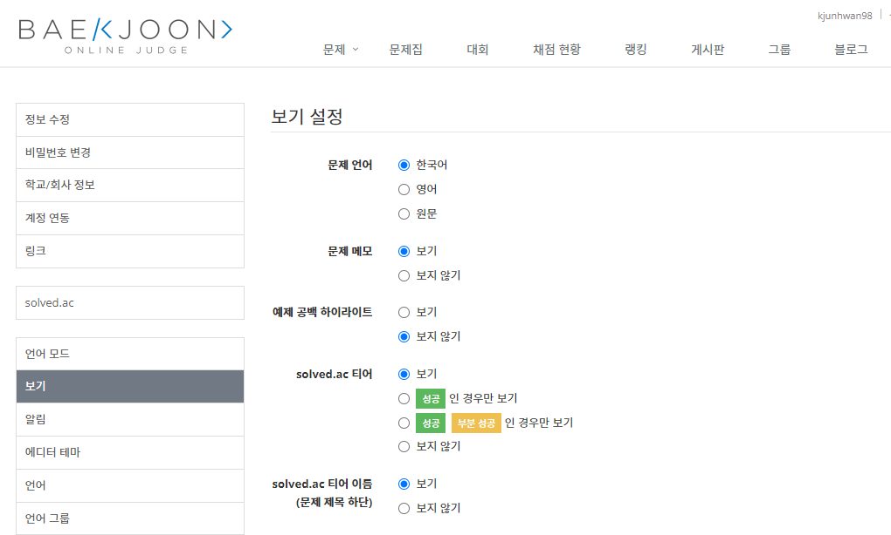
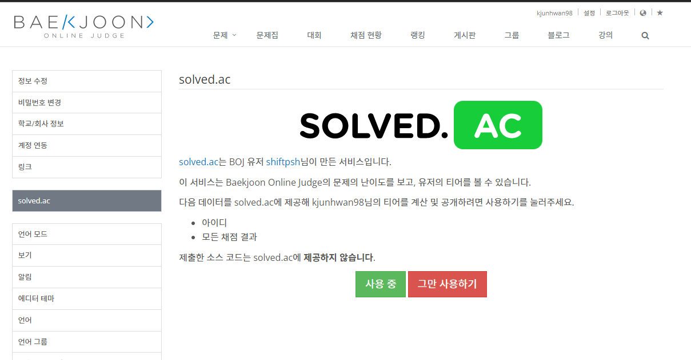
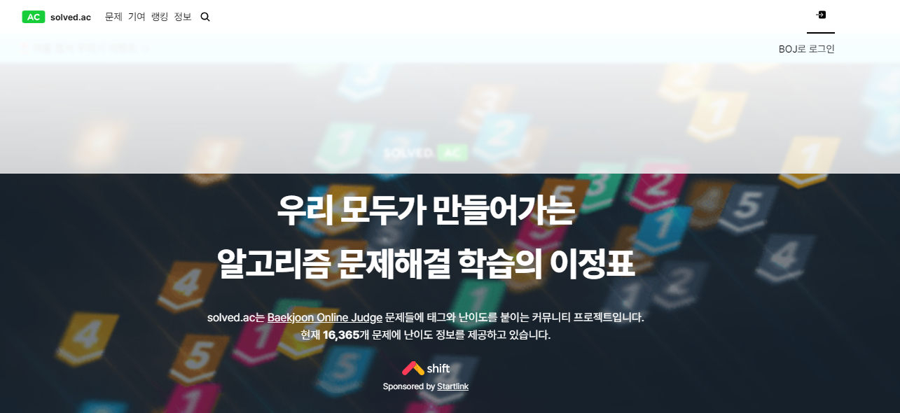
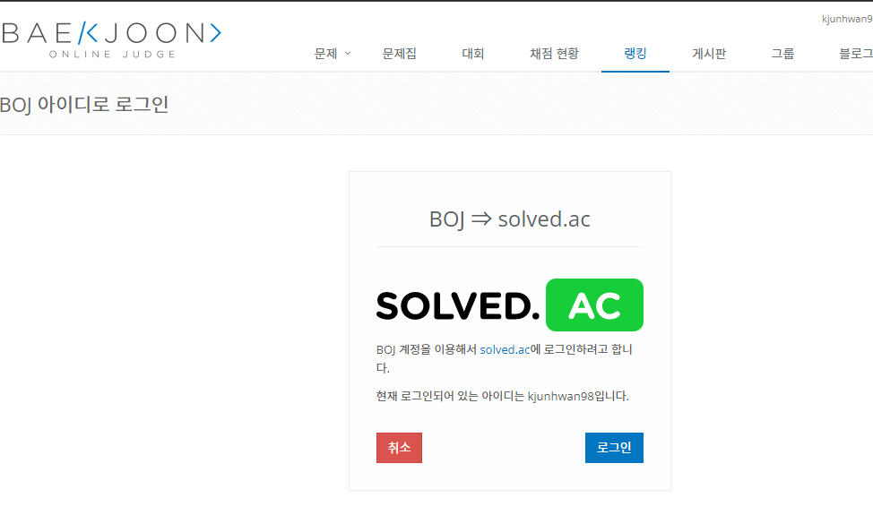

# 백준 티어 깃허브

#백준 #깃허브 #프로필 #티어

> 백준에 가입 또는 로그인을 한다. 우측 위 설정에 들어가 준다.

> 설정 목록들 중에서 '보기' 항목에서 solved.ac. 티어, 이름 모두 보기를 클릭해 준다.

> 왼쪽에 설정 목록들 중에서 solved.ac 클릭 후 사용 클릭! 그 다음 첫 째줄에 하이퍼 링크가 되어 있는 solved.ac클릭해준다.

> solved.ac 사이트로 이동된다. 따로 가입 안해도 백준 아이디로 연동이 된다.

BOJ계정으로 로그인 하기 누른다.

로그인이 완료되고 설정에 들어가면 나의 티어가 보인다.

깃허브에 프로필로 쓰고 싶다면 위의 링크에서 아이디만 바꾸면 된다. 물론 더 다양한 테마가 있으니 테마는 구글링 하면 다양하다.