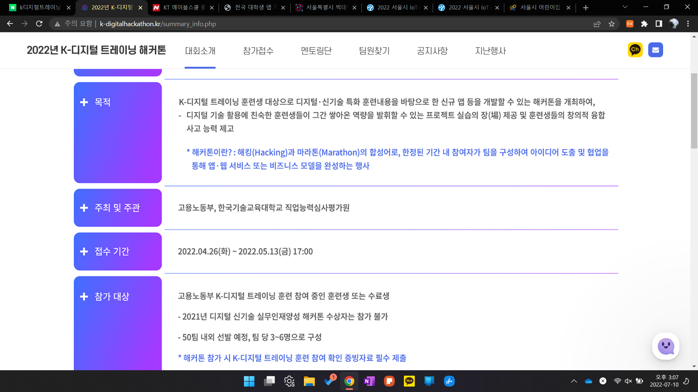

# 주말에 찾아본 해커톤!

#해커톤

해커톤의 개념이 아직 모호해서 찾아보게되었다.

서울시 iot정보 활용 해커톤 그런것도 있었다. 컴공과 친구에게 물어보니 해커톤..그거 쉽지 않다고 했다.ㅋㅋㅋㅋㅋ 원래 모르면 모를수록 용감하다고 하였나! 내가 해보자고 말을 꺼내니 물음표를 마구 던졌다.ㅎㅎ

그래서 좀 더 알아보고 해커톤 중에서도 그래도 완전 고인물들은 없는 해커톤이 수상하기에 그나마 유리해 보여서 찾아보았다.

K-디지털트레이닝 해커톤 이라는 것이 있었다.  KDT과정을 수강한 수강생들 대상이었다. 그나마 지원자가 제한적이라 노려볼만하다.

#### [홈페이지](http://www.k-digitalhackathon.kr/index.php)

#### [후기 블로그](https://blog.naver.com/molab_suda/222790978364)