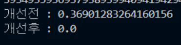

# 우코테 코드 리뷰 2주차


1. 효율성 확인 방법

   - time 모듈 사용

     ```python
     import time
     
     start_time = time.time()
     # 함수
     finish_time = time.time()
     효율성 = finish_time - start_time
     ```

     프로그래머스 전화번호 목록 문제 시간 측정 결과 예시

     

     

     

2. 정렬을 통해 반복문 줄이기

   ```python
   lst = [ 12345, 6789, 123, 67, 8 ]
   
   lst.sort()
   lst = [ 123, 12345, 67, 6789, 8 ]
   ```

   > 정렬을 하게 되면 맨 앞에서 부터 숫자를 비교하며 작은수 부터 정렬된다. 중복되는 숫자는 하나도 없다고 가정하였으므로 접두사로 사용이 된다면 길이가 더 짧은 숫자가 긴 숫자에 포함이 되어있는지로 접두 숫자인지 알 수 있다.  따라서 전체 순회 필요 없이 바로 옆 숫자만 비교하여 현재 숫자가 오른쪽 숫자에 포함되는지만 파악하면 모든 숫자를 비교할 수 있다.

3. 리스트 길이 0이면 False 상태, 뭐라도 있으면 True 상태

   ```python
   lst = []
   while lst:  # lst가 비게 되면 Flase이므로 탈출
   ```

4. BOJ-24523-내 뒤에 나와 다른 수

   ```python
   # 스택
   import sys
   
   input = sys.stdin.readline
   
   n = int(input())
   sequence = list(map(int ,input().split()))
   stack = []
   answer = []
   for i, num in enumerate(sequence):
       while stack and stack[-1] != num:
           answer.append(i + 1)
           stack.pop()
       stack.append(num)
   while stack:
       answer.append(-1)
       stack.pop()
   print(*answer)
   
   ##############
   # 또 다른 버전 뒤로 돌리기
   import sys
   
   input = sys.stdin.readline
   
   n = int(input())
   A = list(map(int, input().split()))
   ans = [-1 for _ in range(n)]
   
   for i in range(n - 2, -1, -1):
       if A[i] == A[i + 1]:
           ans[i] = ans[i + 1]
       else:
           ans[i] = i + 2
   print(*ans)
   ```

   > 스택에 중복된 숫자가 나오면 그 인덱스를 계속 저장한다. 다른 수가 나오면 저장해놓은 숫자 개수만큼 pop하면서 카운트 한다. 

   > 뒤로 돌리기 버전은 기본으로 -1을 정답 리스트에 채워놓고 뒤에서 부터 앞에 수랑 비교하면서 달라지면 달라진 수의 인덱스에 다음 인덱스의 숫자이니까 2를 더해준다. 이런식으로 뒤에서 부터 접근하여 사용할 수있다.
